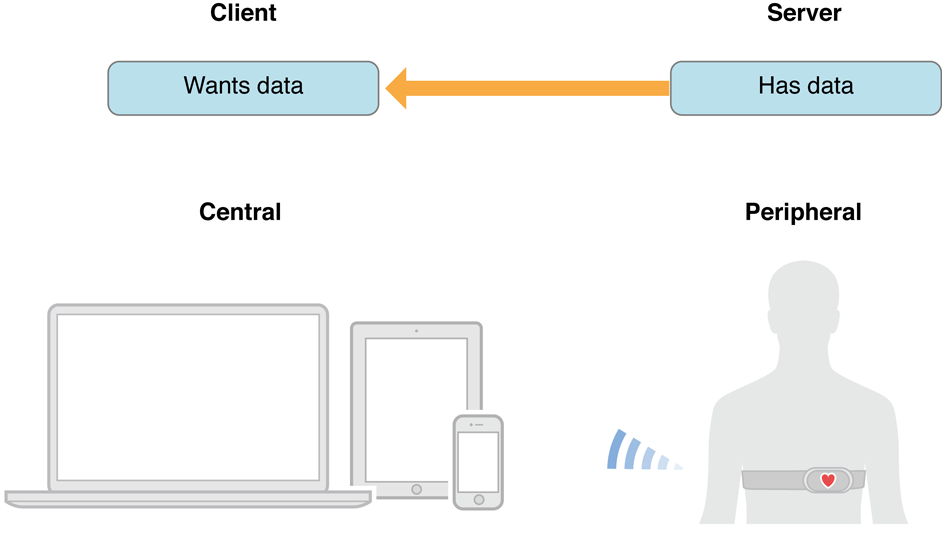

# BLE On Android

## 1. 低功耗蓝牙简介

低功耗蓝牙（BLE）技术从2010年开始引入到蓝牙4.0核心规范中。
它专门面向对成本和功耗都有较高要求的无线解决方案，
可广泛用于卫生保健、体育健身、家庭娱乐、安全保障等诸多领域。
它的主要特点是：超低峰值功耗、平均功耗和待机功耗；使用标准纽扣电池可以运行一年乃至数年；
低成本；不同厂商设备易于实现交互性。

低功耗蓝牙不仅具有着功耗优势，而且还具有显著的应用开发优势。
因为它的成本更低，还提供了灵活的应用开发架构用于创建蓝牙智能传感器应用。
这允许开发人员把日常物品如心率监控器、牙刷、鞋等等都带入到互联世界中，
并与消费者已经拥有的智能手机、平板电脑、或其他智能设备上的应用APP进行沟通。
目前，这项技术已应用于每年出售的数亿台便携设备上，为开拓钟表、远程控制、
医疗保健及运动感应器等广大新兴市场的应用奠定了基础。

图1-1 低功耗蓝牙的典型应用

低功耗蓝牙引入后，Android从4.3版本（API Level 18）开始支持这项技术。
低功耗蓝牙有两种角色：核心（Central）以及外设（Peripheral）。
核心设备用于访问外设的数据和服务，
而外设则是能产生各种数据的传感器以及提供各种服务的设备。
Android 4.3只支持核心这一个角色，这个角色可以让应用搜索周围的设备、
查询它们提供的服务、获取或请求这些服务供应用使用，
这使得Android应用可以访问附近的各种传感和穿戴设备。
而到了5.0之后，Android开始支持外设这个角色，
应用程序利用这个角色的功能可以让附近的设备找到它、
并让附近的设备与其建立连接、访问它的数据与服务。
因此5.0之后，可以创建诸如计步器、健康监控器等功能的应用，
让其他附近的设备与它进行沟通。

图1-2 低功耗蓝牙的两个角色

## 2. BLE具体架构
## 3. 
