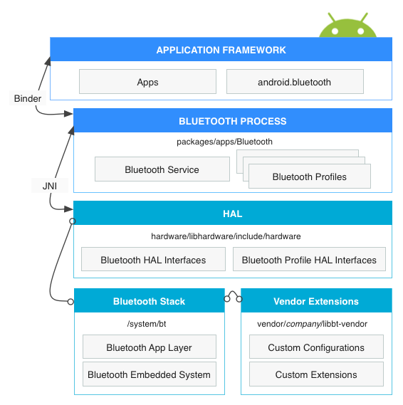
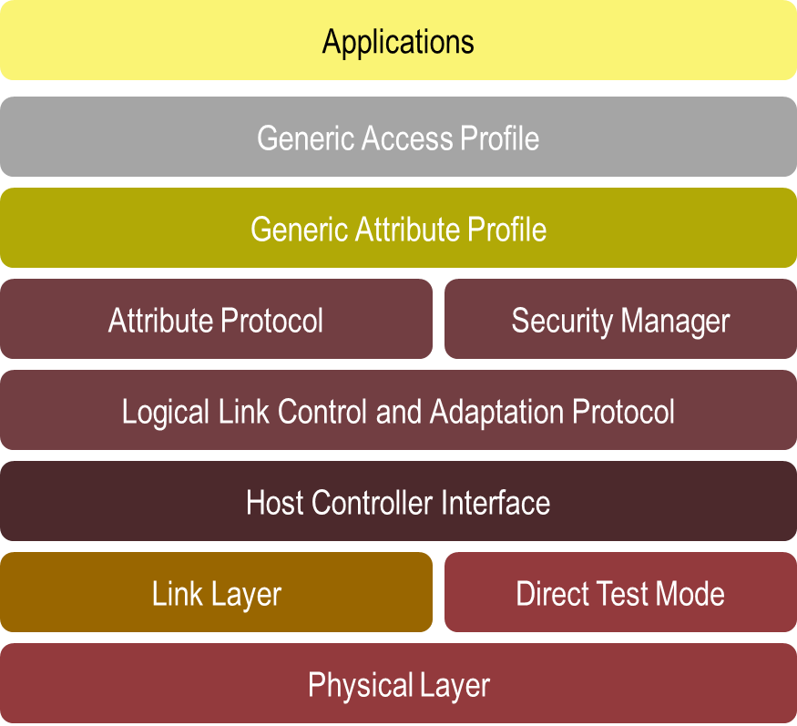
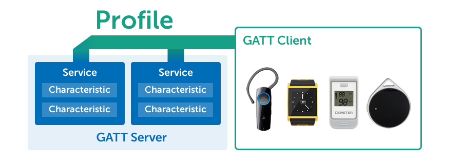

# BLE On Android

## 1. 低功耗蓝牙简介

低功耗蓝牙（BLE）技术从2010年开始引入到蓝牙4.0核心规范中。
它专门面向对成本和功耗都有较高要求的无线解决方案，
可广泛用于卫生保健、体育健身、家庭娱乐、安全保障等诸多领域。
它的主要特点是：超低峰值功耗、平均功耗和待机功耗；使用标准纽扣电池可以运行一年乃至数年；
低成本；不同厂商设备易于实现交互性。

低功耗蓝牙不仅具有超低功耗优势，而且还有明显的应用开发优势。
因为它的成本更低，还提供了灵活的应用开发架构用于创建蓝牙智能传感器应用。
这允许开发人员把日常物品如心率监控器、牙刷、鞋等等都带入到互联世界中，
并与消费者已经拥有的智能手机、平板电脑、或其他智能设备上的应用APP进行沟通。
目前，这项技术已应用于每年出售的数亿台便携设备上，为开拓钟表、远程控制、
医疗保健及运动感应器等广大新兴市场的应用奠定了基础。


图1-1 低功耗蓝牙的典型应用

低功耗蓝牙引入后，Android从4.3版本（API Level 18）开始支持这项技术。
低功耗蓝牙有两种角色：核心（Central）以及外设（Peripheral）。
核心设备用于访问外设的数据和服务，
而外设则是能产生各种数据的传感器以及提供各种服务的设备。
Android 4.3只支持核心这一个角色，这个角色可以让应用搜索周围的设备、
查询它们提供的服务、获取或请求这些服务供应用使用，
这使得Android应用可以方便访问到附近的各种传感或穿戴设备的服务。
而到了5.0之后，Android开始支持外设这个角色，
应用程序利用这个角色的功能可以让附近的设备找到它、
并让附近的设备与其建立连接、访问它的数据与服务。
因此5.0之后，可以创建诸如计步器、健康监控器等功能的应用，
让附近其他设备与它进行沟通。


图1-2 低功耗蓝牙的两个角色

## 2. BLE应用架构

### 2.1 BLE Android架构

首先，Android的蓝牙协议栈（Bluetooth Stack）分成了相互隔离的两层：
最底层的蓝牙嵌入系统（Bluetooth Embedded System, BTE）层实现蓝牙规范核心功能；
上面的蓝牙应用层（Bluetooth Application Layer, BTA）则完成与Android框架的交互。

蓝牙系统服务（Bluetooth System Service）位于蓝牙协议栈之上，它们之间通过JNI进行交互。
最上层的Android应用则通过Binder进程间通信机制与蓝牙系统服务进行沟通。
如下面的Android蓝牙基本架构图。



架构中各模块具体功能如下：
- 应用框架层

    在应用框架层上的是应用代码，它们使用android.bluetooth包中提供的应用接口完成与蓝牙硬件的交互。
    在内部，这些代码通过Binder进程间通信机制完成与蓝牙服务进程的调用。
    BLE相关代码位于frameworks/base/core/java/android/bluetooth/le/文件夹中。

- 蓝牙系统服务层

    蓝牙系统服务相关实现位于packages/apps/Bluetooth/文件夹内。
    它在Android框架层实现了蓝牙服务及蓝牙Profiles，
    并被打包成为一个Android应用APP，这个APP通过JNI调用HAL层的功能。
    BLE相关代码位于packages/apps/Bluetooth/src/com/android/bluetooth/gatt/文件夹，
    以及packages/apps/Bluetooth/src/com/android/bluetooth/btservice/文件夹中。

- JNI层

    蓝牙JNI的代码位于packages/apps/Bluetooth/jni/文件夹内。
    这些JNI代码调用HAL层的功能，并接收来自于HAL层的回调。
    BLE相关代码位于packages/apps/Bluetooth/jni/com_android_bluetooth.h以及
    packages/apps/Bluetooth/jni/com_android_bluetooth_gatt.cpp文件中。

- HAL层

    蓝牙硬件抽象层为蓝牙硬件的访问提供了标准接口。
    这些接口包含在hardward/libhardware/include/hardward/文件夹中。
    与BLE相关代码位于hardware/libhardware/include/hardware/bluetooth.h以及
    hardware/libhardware/include/hardware/bt_gatt.h文件中。

- 蓝牙协议栈层

    默认提供的蓝牙协议栈位于system/bt文件夹下，实现蓝牙应用层（BTA）以及
    蓝牙嵌入系统（BTE）的功能。与BLE相关的代码主要位于如下文件中：
    btif/co/bta_gattc_co.c，
    btif/co/bta_gatts_co.c，
    btif/include/btif_gatt.h，
    btif/include/btif_gatt_*.h，
    btif/src/btif_gatt.c，
    btif/src/btif_gatt_*.c，
    bta/include/bta_gatt_*.h，
    bta/src/gatt/bta_gatt_*.c，
    stack/include/gatt_api.h，
    stack/include/gattdefs.h，
    stack/include/smp_api.h，
    stack/gatt/att_protocol.c，
    stack/gatt/gatt_*.c，
    stack/smp/*.c。

### 2.2 BLE核心规范架构

低功耗蓝牙使用基于服务的架构，所有数据交互都通过GATT（Generic Attribute Profile）来完成。
GATT建立在ATT协议（Attribute Protocol）和SMP协议（Security Manager Protocol）之上，
它定义了如何在Server端将应用或Profile提供的各种服务发布到外部、以及如何响应其他低功耗蓝牙设备的服务请求，
它还定义了如何在Client端搜索附近的服务、以及如何访问和请求这些服务。低功耗蓝牙的完整架构图如下：



底层的L2CAP协议（Logical Link Control and Adaptation Protocol）是两个蓝牙设备之间传输数据的标准接口，
其相关代码定义在stack/l2cap文件夹中。L2CAP下面的HCI接口层（Host Controller Interface）是蓝牙Host与
蓝牙Controller的标准接口，完成蓝牙协议栈与蓝牙芯片的通信。最底层的Link Layer、Direct Test Mode、以及
Physical Layer属于蓝牙Controller部分，位于蓝牙芯片内部。

### 2.3 服务定义与角色

一个低功耗蓝牙应用可以提供多个服务（Service），服务使用特性（Characteristic）进行描述，
每个服务可以包含多个特性，每个特性描述这个服务特性的详细信息，如图2-1。



图2-1 GATT服务

每个服务特性包含一个值（Value）以及多个对这个值的描述（Descriptor），
描述来于指定诸如值的字符串描述、值定义范围、值测量单位等等信息，如图2-2。


图2-2 服务特性

服务特性的值和描述都是通过属性（Attribute）来定义的，
属性都关联了一个唯一的128位UUID，用来表示一个独一无二的数据信息。
属性是GATT数据传输的单位，GATT使用ATT协议对这些属性进行传输。

相互通信的两个低功耗蓝牙设备，请求服务一方的GATT称为GATT Server，
提供服务的一方的GATT成为GATT Client。

### 2.4 属性传输协议

GATT使用属性传输协议（ATT）进行数据包传输。
有多种数据包类型，包括命令（Commands）、请求（Requests）、响应（Responses）、
指示（Indications）、通知（Notifications）、以及确认（Confirmations）。
这6种数据包中：请求包由Client发给Server，Server收到后必须响应一个响应包；
而指示包则恰恰相反，它由Server发给Client，Client收到后必须响应一个确认包；
另外Client可以自由向Server发送命令包，Server可以自由向Client发送通知包，
都不需要等待对方的回应。
这些数据包都通过ATT的协议数据单元（PDU）进行传送，它的格式如图2-3。


图2-3 ATT协议数据单元的格式

其中操作码（Opcode）指定属性参数（Attribute Parameters）的类型、格式及含义，而属性参数则包含具体数据。
可选部分Authentication Signature如果指定，则表示跟安全验证相关的识别标志。

## 3. 构建BLE应用

### 3.1 开启BLE应用

在使用低功耗蓝牙之前，首先需要确认设备是否支持这个特性，
如果支持还要确认蓝牙是否已经打开。这两个步骤通过BluetoothAdapter完成。
BluetoothAdapter是所有蓝牙Activity都必须的，它代表当前设备的蓝牙适配器。
整个系统只有一个蓝牙适配器，你的应用可以通过这个对象访问这个适配器。

确认设备是否支持BLE：
```java
// Use this check to determine whether BLE is supported on the device. Then
// you can selectively disable BLE-related features.
if (!getPackageManager().hasSystemFeature(PackageManager.FEATURE_BLUETOOTH_LE)) {
    Toast.makeText(this, R.string.ble_not_supported, Toast.LENGTH_SHORT).show();
    finish();
}
```

确认设备上的蓝牙是否已经打开，如果没有打开则发送一个打开请求：
```java
private BluetoothAdapter mBluetoothAdapter;
...
// Initializes Bluetooth adapter.
final BluetoothManager bluetoothManager =
        (BluetoothManager)getSystemService(Context.BLUETOOTH_SERVICE);
mBluetoothAdapter = bluetoothManager.getAdapter();
...
// Ensures Bluetooth is available on the device and it is enabled. 
// If not, displays a dialog requesting user permission to enable Bluetooth.
if (mBluetoothAdapter == null || !mBluetoothAdapter.isEnabled()) {
    Intent enableBtIntent = new Intent(BluetoothAdapter.ACTION_REQUEST_ENABLE);
    startActivityForResult(enableBtIntent, REQUEST_ENABLE_BT);
}
```

### 3.2 搜索BLE设备

搜索附近的BLE设备，需要通过调用BluetoothAdapter的startLeScan()来完成，
以及需要提供搜索回掉函数BluetoothAdapter.LeScanCallback。

使用startLeScan()搜索BLE设备：
```java
private boolean mScanning;
private Handler mHandler;

// Stops scanning after 10 seconds.
private static final long SCAN_PERIOD = 10000;
...
private void scanLeDevice(boolean enable) {
  if (enable) {
    // Stops scanning after a pre-defined scan period.
    mHandler.postDelayed(new Runnable() {
      @Override
      public void run() {
        mScanning = false;
        mBluetoothAdapter.stopLeScan(mLeScanCallback);
      }
    }, SCAN_PERIOD);
    
    mScanning = true;
    mBluetoothAdapter.startLeScan(mLeScanCallback);
  } 
  else {
    mScanning = false;
    mBluetoothAdapter.stopLeScan(mLeScanCallback);
  }
  ...
}
```

定义回调接收搜索结果：
```java
private LeDeviceListAdapter mLeDeviceListAdapter;
...
// Device scan callback.
private BluetoothAdapter.LeScanCallback mLeScanCallback = new BluetoothAdapter.LeScanCallback() {
  @Override
  public void onLeScan(BluetoothDevice device, int rssi, byte[] scanRecord) {
    runOnUiThread(new Runnable() {
      @Override
      public void run() {
        mLeDeviceListAdapter.addDevice(device);
        mLeDeviceListAdapter.notifyDataSetChanged();
      }
    });
  }
};
```

### 3.3 连接到GATT Server

与附近的BLE设备进行交互，首先第一步需要与它建立连接。
可以通过BluetoothDevice的connectGatt()连接对应的GATT Server，
并通过定义BluetoothGattCallback接收连接结果。
可以通过上一步中搜索到的BLE蓝牙设备的地址获取到BluetoothDevice。

使用BLE蓝牙设备地址连接到对方设备：
```java
private BluetoothGatt mBluetoothGatt;
...
BluetoothDevice device = mBluetoothAdapter.getRemoteDevice(remoteLeAddress);
mBluetoothGatt = device.connectGatt(this, false, mGattCallback);
```

定义回调接收连接结果：
```java
```

### 3.4 读取BLE属性
### 3.5 接收GATT通知


### 3.6 关闭BLE应用

最后，可以调用BluetoothGatt的close()方法关闭BLE连接应用：
```java
public void close() {
  if (mBluetoothGatt == null) {
    return;
  }
  mBluetoothGatt.close();
  mBluetoothGatt = null;
}
```
