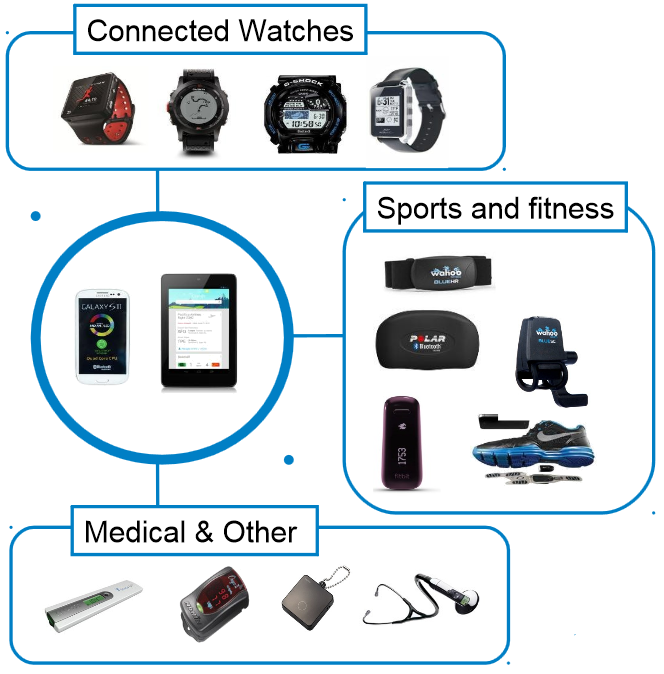

# BLE On Android

## 1. 低功耗蓝牙简介

低功耗蓝牙（BLE）技术从2010年开始引入到蓝牙4.0核心规范中。
它专门面向对成本和功耗都有较高要求的无线解决方案，
可广泛用于卫生保健、体育健身、家庭娱乐、安全保障等诸多领域。
它的主要特点是：超低峰值功耗、平均功耗和待机功耗；使用标准纽扣电池可以运行一年乃至数年；
低成本；不同厂商设备易于实现交互性。

低功耗蓝牙不仅具有超低功耗优势，而且还有明显的应用开发优势。
因为它的成本更低，还提供了灵活的应用开发架构用于创建蓝牙智能传感器应用。
这允许开发人员把日常物品如心率监控器、牙刷、鞋等等都带入到互联世界中，
并与消费者已经拥有的智能手机、平板电脑、或其他智能设备上的应用APP进行沟通。
目前，这项技术已应用于每年出售的数亿台便携设备上，为开拓钟表、远程控制、
医疗保健及运动感应器等广大新兴市场的应用奠定了基础。

图1-1 低功耗蓝牙的典型应用

低功耗蓝牙引入后，Android从4.3版本（API Level 18）开始支持这项技术。
低功耗蓝牙有两种角色：核心（Central）以及外设（Peripheral）。
核心设备用于访问外设的数据和服务，
而外设则是能产生各种数据的传感器以及提供各种服务的设备。
Android 4.3只支持核心这一个角色，这个角色可以让应用搜索周围的设备、
查询它们提供的服务、获取或请求这些服务供应用使用，
这使得Android应用可以方便访问到附近的各种传感设备或穿戴设备的服务。
而到了5.0之后，Android开始支持外设这个角色，
应用程序利用这个角色的功能可以让附近的设备找到它、
并让附近的设备与其建立连接、访问它的数据与服务。
因此5.0之后，可以创建诸如计步器、健康监控器等功能的应用，
让附近其他设备与它进行沟通。

图1-2 低功耗蓝牙的两个角色

## 2. BLE应用架构

首先，Android的蓝牙协议栈（Bluetooth Stack）分成了相互隔离的两层：
最底层的蓝牙嵌入系统（Bluetooth Embedded System, BTE）层实现蓝牙最核心功能；
而上面的蓝牙应用层（Bluetooth Application Layer, BTA）则完成与上层Android框架的交互和沟通。

蓝牙系统服务（Bluetooth System Service）位于蓝牙协议栈之上，它们之间通过JNI进行交互。
而最上层的Android应用则通过Binder进程间通信机制与蓝牙系统服务进行交互。
如下面的Android蓝牙基本架构图。

架构中各模块具体功能如下：
- 应用框架层

    在应用框架层上的是应用代码，它们使用android.bluetooth包中提供的应用接口完成与蓝牙硬件的交互。
    在内部，这些代码通过Binder进程间通信机制完成与蓝牙服务进程的调用。

- 蓝牙系统服务层

    蓝牙系统服务相关实现位于packages/apps/Bluetooth/文件夹内。
    它在Android框架层实现了蓝牙服务及蓝牙Profiles，
    并被打包成为一个Android应用APP，这个APP通过JNI调用HAL层的功能。

- JNI层

    蓝牙JNI的代码位于packages/apps/Bluetooth/jni/文件夹内。
    这些JNI代码调用HAL层的功能，并接收来自于HAL层的回调。

- HAL层

    蓝牙硬件抽象层为蓝牙硬件的访问提供了标准接口。
    这些接口包含在hardward/libhardware/include/hardward/文件夹中。

- 蓝牙协议栈层

    默认提供的蓝牙协议栈位于system/bt文件夹下，协议栈实现了HAL声明的功能，
    并且能够通过扩展以及改变配置对是蓝牙进行客制化。

- 厂商扩展层

    用于增加定制扩展功能，以及跟踪调试用的HCI层。

## 3. 
